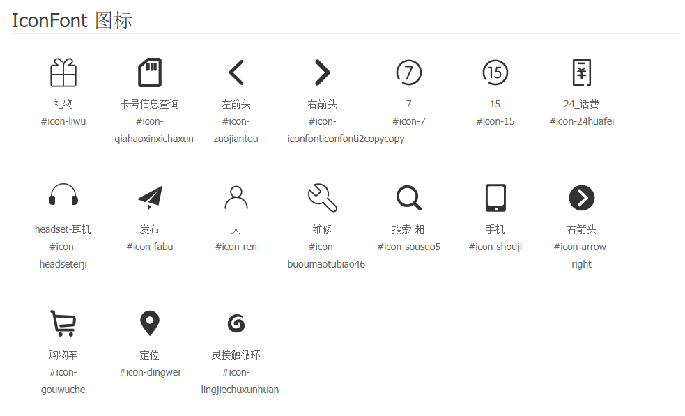

# 仿小米官网

> 2018-07-16-15:22,创建项目，开始耕耘代码，把网站的整体架构写好了<br>
> 2018-07-16-13:20,顶部导航区域代码已经写好了<br>
> 2018-07-16-15:02,logo和搜索以及nav区域代码也已经写好了<br>
> 2018-07-16-17:39,详细产品和轮播区域代码也已经写完了哈<br>
> 2018-07-17-11:30,小区域内容代码完成（就是box区域的哈）<br>
> 2018-07-17-16:43,小米闪购区域代码完成<br>
> 2018-07-17-17:26,小米广告区域代码完成<br>
> 2018-07-18-09:00,顶部区域右侧的购物车特效用纯CSS的代码完成<br>
> 2018-07-18-14:28,内容展示区域手机类代码完成，还修复了闪购区域的代码<br>
> 2018-07-19-08:35,内容展示区域手机类下的广告区域代码完成<br>
> 2018-07-19-10:20,内容展示区域家电类区域代码完成，还完成了hover特效<br>
> 2018-07-19-20:15,内容展示区域手机类区域增加了hover特效<br>
> 2018-07-21-08:53,内容展示区域家电类hover特效显示评价，修复一些其他bug<br>
> 2018-07-22-06:31,内容展示区域为你推荐代码完成，还完成了hover特效<br>
> 2018-07-22-10:25,内容展示区域热评产品代码完成，还完成了hover特效<br>
> 2018-07-26-15:38,生病回家休养了几天，好点了，开始接下来的内容区域代码<br>
> 2018-07-26-17:22,内容展示区域内容代码完成，依旧增加了hover特效哈<br>
> 2018-07-27-09:43,完善内容展示区域内容代码<br>
> 2018-07-27-10:30,内容展示区域视频代码完成，到此内容展示区域代码已经全部完成<br>
> 2018-07-27-10:52,页脚顶部区域代码完成<br>
> 2018-07-27-10:52,页脚内容区域代码完成<br>
> 2018-07-27-13:24,页脚区域代码全部完成<br>

```
礼物    icon-liwu
卡号信息查询    icon-qiahaoxinxichaxun
左箭头  icon-zuojiantou
右箭头  icon-iconfonticonfonti2copycopy
7   icon-7
15  icon-15
24_话费 icon-24huafei
headset-耳机    icon-headseterji
发布    icon-fabu
人  icon-ren
维修    icon-buoumaotubiao46
搜索 粗 icon-sousuo5
手机    icon-shouji
右箭头  icon-arrow-right
购物车  icon-gouwuche
定位    icon-dingwei
灵接触循环  icon-lingjiechuxunhuan
```

```
<svg class="icon" aria-hidden="true">
    <use xlink:href="#icon-xxx"></use>
</svg>
```


关注分享，关注导航，关注馨客栈


